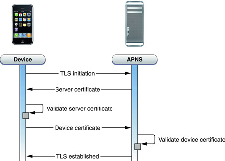
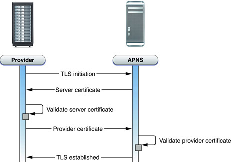

##Apple Push Notification Services
APNS 全名為 Apple Push Notification Service，也就是大家常說的 Push Notification 或者是 Server Push 技術，簡單說就是主動由 Server 發送訊息到 Client 的方法，而通常這樣的技術都會實作穿越防火牆的能力。在 iOS 所提供的 APNS 的架構中，包含了以下幾種角色：
<ul>
<li>Device - 就是你的行動上網裝置 (MID)</li>
<li>APNS - Apple 提供連線服務的伺服器 (Gateway)</li>
<li>Provider - 需要自行實作的訊息發送者</li>
</ul>
接收 Notification 的單位稱為 Device，發送 Notification 的單位稱為 Provider。Provider 與 Device 這兩個單位皆需要與 APNS 進行溝通，必須認證連線後才能正確工作。Device 就是我們的行動裝置 (iPhone/iPad)，當有網路的時候 iOS 就動裝置會自動連上 APNS，並且登入自己的裝置，這時 Device 就準備好可以接收訊息了，其架構圖可以參考下圖：
  

而負責發送訊息的 Provider 就需要自行透過憑證建立連線來發送訊息，連線時使用 SSL TLS 機制進行認證與加密，下圖為 Apple 官方提供的驗證架構圖：
  

接下來則會開始進行Push Service需要的連線憑證 SSL Push Certificate申請教學。

##SSL Push Certificate申請教學

1. 首先進入到ios developer center,